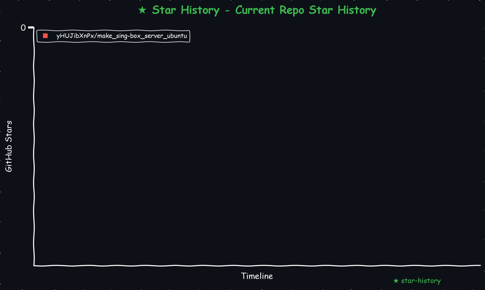

# make_sing-box_server_ubuntu
为ubuntu服务器创建sing-box服务

    
<!-- <a href="https://star-history.com/#yHUJibXnPx/make_sing-box_server_ubuntu&Date">
  <picture>
    <source media="(prefers-color-scheme: dark)" srcset="https://api.star-history.com/svg?repos=yHUJibXnPx/make_sing-box_server_ubuntu&type=Date&theme=dark" />
    <source media="(prefers-color-scheme: light)" srcset="https://api.star-history.com/svg?repos=yHUJibXnPx/make_sing-box_server_ubuntu&type=Date" />
    
  </picture>
</a> -->
<!-- START_STAR_HISTORY_SELF -->

<!-- END_STAR_HISTORY_SELF -->

## 目录结构
    .
    ├── LICENSE                                     # TIM 协议  
    ├── make_sing-box_server_ubuntu.sh              # 为ubuntu服务器创建sing-box服务脚本  
    ├── export_nodes.py                             # 解析sing-box服务产生的订阅节点脚本  
    ├── requestment.txt                             # Python脚本所需依赖  
    ├── make_star_chart.py                          # 生成 星星统计 脚本  
    └── README.md                                   # 项目描述  

## 使用方法(假设默认是 $HOME 目录)
1. 打开终端下载脚本，例如：

   ```bash
   cd $HOME
   curl -L -C - --retry 3 --retry-delay 5 --progress-bar -o $HOME'/make_sing-box_server_ubuntu.sh' 'https://github.com/yHUJibXnPx/make_sing-box_server_ubuntu/raw/refs/heads/master/make_sing-box_server_ubuntu.sh'
   ```

2. 给脚本授权并执行：

   ```bash
   chmod -v +x $HOME/make_sing-box_server_ubuntu.sh
   ./make_sing-box_server_ubuntu.sh
   ```
3. 安装完成后，将生成配置文件与可执行二进制：

   ```plaintext
    $HOME/
    ├── client.json                     # 支持最新版 sing-box 客户端配置
    ├── client_1.11.4.json              # 支持1.11.4版 sing-box 客户端配置
    ├── client_openwrt_sing-box.json    # 支持最新版 sing-box openwrt 客户端配置
    ├── cloudflared                     # cloudflare 透传主程序
    ├── cloudflared*.log                # cloudflare 日志
    ├── config                          # sing-box 配置目录
    ├── config.json                     # sing-box 配置文件
    ├── jq                              # json处理格式化工具
    ├── result.txt                      # 脚本处理结果预览
    ├── sing-box.log                    # sing-box 日志
    ├── sing-boxs                       # sing-box 主程序目录
    │   ├── LICENSE                     # sing-box 不知道干啥用的依赖库吧？
    │   ├── libcronet.so                # sing-box 不知道干啥用的文件？
    │   └── sing-box                    # sing-box 主程序
    ├── subscription.txt                # 明文聚合节点
    └── subscription_base64.txt         # base64聚合节点
    
    2 directories, 14 files
   ```

4. ui 端口 ip:9999 混合代理端口 ip:7890 , 不过注意 ios sing-box tv 1.11.4 内核版本目前访问 ui 只能 127.0.0.1:9999 且也不支持混合代理

## 卸载（可选）
若要清理所有文件：
```bash
# 终止进程
pkill -9 -f ${HOME}/sing-boxs/sing-box
pkill -9 -f ${HOME}/cloudflared
# 删除资料
pushd ${HOME}
rm -frv client_1.11.4.json client.json client_openwrt_sing-box.json config.json \
  result.txt subscription.txt subscription_base64.txt config \
  cloudflared sing-boxs cloudflared*.log sing-box.log \
  jq make_sing-box_server_ubuntu.sh
popd
```

## 许可证
本项目采用 [MIT License](LICENSE) 许可。

## 联系与反馈
遇到问题或有改进建议，请在 [issues](https://github.com/yHUJibXnPx/make_sing-box_server_ubuntu/issues) 中提出，或直接联系项目维护者。

## 参考
[sing-box doc](https://github.com/SagerNet/sing-box)  
[sing-box](https://sing-box.sagernet.org)  
[cloudflared](https://github.com/cloudflare/cloudflared)  
[jq](https://github.com/jqlang/jq)  

# 声明
本项目仅作学习交流使用，用于解决生理需求，学习各种姿势，不做任何违法行为。仅供交流学习使用，出现违法问题我负责不了，我也没能力负责，我没工作，也没收入，年纪也大了，你就算灭了我也没用，我也没能力负责。
